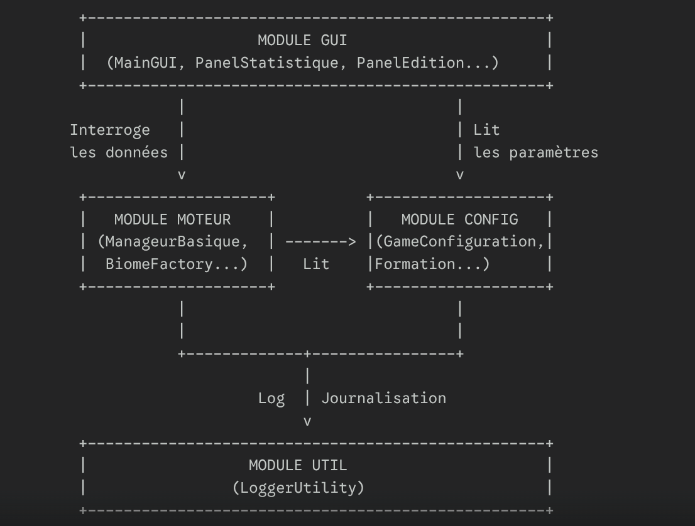
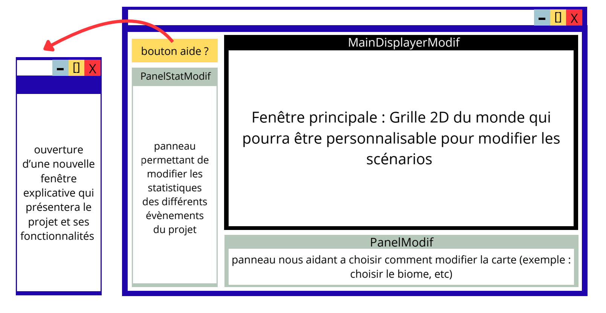
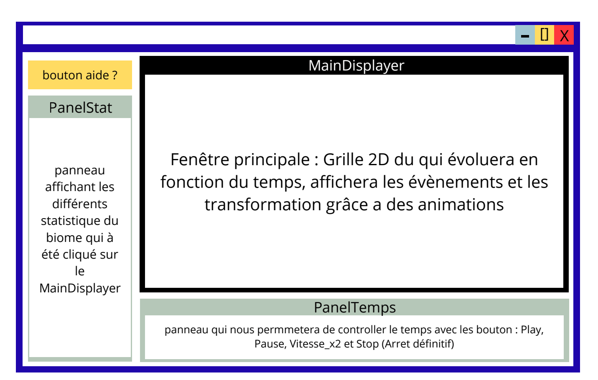

# RAPPORT - Projet Environnement

## Structure obligatoire

### Page de garde
- CY Cergy-Paris Université
- RAPPORT
- Projet Génie Logiciel et Conception (L2)
- L2 Informatique
- **Environnement** (titre du projet)
- Auteurs: Feraoun Mohamed Amine, Nidhal Ourdani, Anurajan Thenuxan
- Avril 2026

---

## Introduction (1 mot - OBLIGATOIRE)

### Contexte du projet


Le projet Environnement est une application de simulation écologique développée en Java. Une simulation écologique est un modèle informatique qui reproduit l'évolution d'un écosystème naturel au cours du temps, permettant d'étudier les interactions entre différents éléments et leur environnement.

Dans ce projet, l'écosystème est représenté par une grille où chaque cellule contient un biome, c'est-à-dire une région naturelle caractérisée par son climat et sa végétation. Sept types de biomes sont modélisés : Forêt, Désert, Mer, Montagne, Banquise, Ville et Village. Chaque biome possède des propriétés intrinsèques (température, humidité, pollution, purification) qui définissent son état environnemental.

La dimension temporelle de la simulation est gérée par rounds. À chaque round, des événements météorologiques (Pluie, Vent, Pollution, Météore) affectent les caractéristiques des biomes et peuvent déclencher des transformations automatiques selon des règles écologiques prédefinies. Par exemple, une forêt touchée par une longue période de sécheresse peut se transformer en désert.

### Problématique

La problématique centrale du projet consiste à concevoir un système de simulation permettant de gérer l'évolution d'un écosystème sur une grille. Plusieurs questions guident le développement :

- Comment un biome réagit-il aux conditions environnementales changeantes (température, humidité, pollution) ?
- Comment les événements climatiques propagent-ils leurs effets sur la carte ?
- Quand et comment un biome se transforme-t-il en un autre type de biome ?
- Comment visualiser cette évolution sur une interface graphique ?

Ces questions visent l'objectif de créer une simulation dynamique et réaliste, accessible via une interface graphique.

### Enjeux

Le projet présente plusieurs enjeux majeurs sur le plan de la conception logicielle :

- **Extensibilité** : L'architecture doit permettre d'ajouter facilement de nouveaux types de biomes ou d'événements sans modifier le code existant. Cela implique une séparation claire entre les données et les traitements.

- **Maintenabilité** : Le code doit être modulaire et bien structuré pour faciliter les futures évolutions et corrections. Une mauvaise conception rendrait le projet difficile à maintenir à long terme.

- **Travail collaboratif** : En équipe de trois développeurs, une conception claire et des conventions partagées sont essentielles pour éviter les conflits et garantir la cohérence du code.

- **Modélisation réaliste** : Les règles de transformation écologique doivent refléter des phénomènes naturels plausibles tout en restant simples à implémenter.

### Objectif principal


L'objectif principal est de développer une application complète de simulation écologique permettant :

- La création d'une carte configurable composée de sept types de biomes (Forêt, Désert, Mer, Montagne, Banquise, Ville, Village)
- L'apparition dynamique d'événements environnementaux (Pluie, VentFroid, VentChaud, Pollution, Purification, Météore, et leurs variantes)
- La transformation automatique des biomes selon huit règles écologiques : Inondation, Glaciation, Désertification, Forestation, PollutionExtreme, Civilisation, Densification, PluieAcide
- La visualisation en temps réel via une interface graphique interactive en Java Swing

### Objectifs secondaires

Plusieurs fonctionnalités optionnelles peuvent enrichir l'application :

- Mini fenêtre affichant les statistiques de chaque biome en temps réel
- Mouvement fluide des événements sur la carte
- Options de personnalisation (paramètres de configuration, probabilités d'événements)
- Graphiques d'évolution des statistiques au cours du temps

### Organisation du rapport

Ce rapport est organisé en plusieurs sections distinctes :

1. **Page de garde** : Présentation du projet, des auteurs et de l'établissement
2. **Introduction** : Contexte, problématique, enjeux et objectifs
3. **Spécification** : Fonctionnalités attendues, contraintes techniques et règles de fonctionnement
4. **Conception et mise en œuvre** : Architecture logicielle, diagrammes de classes, explication des patterns de conception, interface graphique
5. **Manuel utilisateur** : Procédures d'installation, de compilation et d'exécution, guide d'utilisation
6. **Déroulement du projet** : Phases de développement et organisation de l'équipe
7. **Conclusion et perspectives** : Bilan du travail réalisé et perspectives d'amélioration
8. **Difficultés et solutions** : Problèmes rencontrés خلال le développement et leurs résolutions
9. **Références bibliographiques** : Sources documentaires utilisées

---

## Spécification

Cette section détaille les fonctionnalités attendues du projet ainsi que les contraintes qui définissent son comportement. Elle constitue la base de la conception qui sera développée dans la section suivante.

### Notions de base et contraintes du projet

#### 2.1.1 Fonctionnement général du logiciel

Le fonctionnement du logiciel repose sur un modèle de simulation par tours, appelés rounds. À chaque round, le système exécute un cycle complet divisé en quatre étapes distinctes.

**1. Génération d'événements**
Au début de chaque round, de nouveaux événements météorologiques apparaissent aléatoirement sur la carte. Ces événements peuvent être des pluie, du vent, de la pollution, ou des météores.

**2. Déplacement des événements**
Les événements mobiles se déplacent d'une case dans une direction donnée. Ce déplacement peut être bloqué par les montagnes.

**3. Application des impacts**
Les événements affectent les caractéristiques des biomes qu'ils traversent.

**4. Évaluation des transformations**
Les règles de transformation vérifient les conditions sur les propriétés des biomes. Si les critères sont atteints, le biome se transforme en un autre type.


La carte est représentée par une grille bidimensionnelle où chaque cellule contient un biome. Les dimensions de la grille sont configurables. Chaque biome possède quatre propriétés numériques.

#### 2.1.2 Notions et terminologies de base

Cette sous-section définit les termes techniques utilisés dans le projet :

**Biome** : Unité de base de la carte représentant un type d'écosystème (Forêt, Désert, Mer, Montagne, Banquise, Ville, Village).

**Round** : Cycle d'exécution de la simulation comprenant génération, déplacement, impact et transformation.

**Événement** : Phénomène météorologique affectant les caractéristiques des biomes (Pluie, Vent, Pollution, etc.).

**Transformation** : Changement automatique d'un biome vers un autre type selon des règles définies.

**Carte** : Grille bidimensionnelle de cellules contenant chacune un biome.

**Propriétés** : Les quatre caractéristiques numériques d'un biome (température, humidité, pollution, purification).

#### 2.1.3 Contraintes et limitations connues

1. Améliorer la formulation de tes points actuels
Tu peux rendre tes premières limitations un peu plus formelles :

Absence de persistance des données (Sauvegarde) : L'état de l'écosystème est intégralement géré en mémoire vive lors de l'exécution. Le logiciel ne dispose actuellement pas d'un système de sérialisation ou d'exportation (vers un format JSON ou XML, par exemple) permettant de sauvegarder l'état exact des biomes et des entités pour reprendre une simulation ultérieurement.

Limites de l'Interface Homme-Machine (IHM) : L'interface graphique, développée avec les bibliothèques standards, possède une résolution figée à 1920×1080 pixels. Le positionnement absolu des composants empêche un redimensionnement dynamique de la fenêtre (responsivité). De plus, l'ergonomie du mode édition reste basique : la manipulation de l'environnement s'effectue instance par instance, sans implémentation de fonctionnalités de sélection de masse, de duplication de zones (copier-coller) ou de création de "templates" de biomes.

2. Nouvelles limitations techniques à ajouter (Idéales pour ton projet)
Pour remplir la page, ajoute deux ou trois de ces limitations, qui collent parfaitement à un simulateur d'écosystème en Java :

Goulet d'étranglement des performances (Scalabilité) : La simulation de l'écosystème implique des calculs fréquents pour chaque entité et événement environnemental. Au fur et à mesure que le nombre d'éléments augmente sur la carte, le gestionnaire principal (le ManageurBasique) doit traiter une quantité exponentielle d'interactions. L'application étant contrainte par la gestion des threads (notamment le thread d'interface de Swing), un nombre trop important d'entités simultanées provoque des ralentissements visibles et une chute du taux de rafraîchissement (FPS).

Extensibilité via le code source uniquement : Bien que l'architecture soit robuste (utilisation de la BiomeFactory et du pattern Visiteur pour la gestion des interactions), l'ajout de nouveaux comportements ou de nouveaux types de biomes nécessite impérativement une modification du code source en Java et une recompilation du projet. Le logiciel ne permet pas le chargement dynamique de nouveaux éléments via des fichiers de configuration externes.

Simplification du modèle biologique : Pour des raisons de viabilité algorithmique, les événements dynamiques et les interactions entre les entités et l'environnement reposent sur des modèles mathématiques simplifiés et déterministes. La simulation ne prend pas en compte le chaos inhérent aux véritables écosystèmes biologiques, limitant ainsi le degré de réalisme des comportements émergents.

### Fonctionnalités attendues du projet

#### Gestion de la carte

La carte de simulation est représentée par une grille bidimensionnelle de cellules, appelées blocs. Chaque bloc contient un biome et est identifié par ses coordonnées (x, y). Les dimensions de la grille sont configurables (par exemple 20×20 ou 30×30).

La grille fonctionne selon un système de coordonnées où chaque position (x, y) correspond à une cellule précise. Les méthodes permettent de récupérer un bloc à partir de ses coordonnées et de vérifier la validité d'une position avant d'accéder au biome.

La génération de la carte peut se faire de manière aléatoire avec une distribution pseudo-aléatoire des biomes. Les probabilités de chaque type de biome sont définies dans le fichier de configuration, permettant d'ajuster la répartition souhaitée.


Chaque bloc peut être consulté et modifié via des méthodes d'accès. La configuration permet de définir les dimensions par défaut et les probabilités de distribution des biomes.

#### Gestion des biomes

L'application modélise sept types de biomes, chacun représentant un écosystème distinct : Forêt, Désert, Mer, Montagne, Banquise, Ville et Village.

Chaque biome possède quatre propriétés numériques qui définissent son état environnemental :

- **Température** : degré thermique du biome
- **Humidité** : niveau d'humidité
- **Pollution** : niveau de pollution
- **Purification** : capacité de régénération naturelle

Le tableau suivant présente les valeurs initiales de ces propriétés pour chaque type de biome :

| Biome | Température | Humidité | Pollution | Purification |
|-------|------------|---------|-----------|--------------|
| Forêt | 18.0 | 70 | 5 | 20 |
| Désert | 45.0 | 5 | 0 | 2 |
| Mer | 15.0 | 100 | 10 | 5 |
| Village | 22.0 | 40 | 50 | 0 |
| Banquise | -10.0 | 80 | 0 | 5 |
| Montagne | 5.0 | 30 | 2 | 10 |
| Ville | 25.0 | 50 | 40 | 5 |

Ces propriétés évoluent sous l'effet des événements climatiques et peuvent déclencher des transformations automatiques selon les règles définies. La montagne fait exception : elle est immuable et ne peut être transformée par aucune règle.

**Transformations entre biomes**
Les biomes peuvent se transformer selon des chaînes logiques. Par exemple, une Forêt touchée par la désertification devient un Désert, puis le meme desert peut devenir une Forêt sous l'effet de la forestation. Ces transformations reflètent des phénomènes écologiques réels.

#### Gestion des événements

L'application gère treize types d'événements différents, divisés en deux catégories :

**Événements statiques**
Ces événements restent à une position fixe pendant leur durée de vie. Le Météore est le seul événement statique : il apparaît aléatoirement et affecte une zone autour de sa position.

**Événements mobiles**
Ces événements se déplacent d'une case à chaque round dans une direction donnée. Ils traversent la carte et affectent les biomes qu'ils traversent.

| Événement | Catégorie | Durée | Température | Humidité | Pollution | Purification |
|----------|----------|------|------------|----------|------------|-------------|
| Pluie | Mobile | 4 | 0 | +5 | 0 | 0 |
| PluieAcide | Mobile | 4 | 0 | +5 | +10 | 0 |
| VentFroid | Mobile | 4 | -5 | 0 | 0 | 0 |
| Pollution | Mobile | 4 | 0 | 0 | +10 | 0 |
| Purification | Mobile | 4 | 0 | 0 | 0 | +5 |
| Météore | Statique | 20 | +50 | 0 | +20 | 0 |
| Orage | Mobile | 6 | 0 | +10 | 0 | 0 |
| Grêle | Mobile | 3 | -10 | +5 | 0 | 0 |
| Tornade | Mobile | 8 | 0 | +5 | +5 | 0 |
| PluieBénite | Mobile | 5 | 0 | +8 | -5 | +10 |
| Zéphyr | Mobile | 3 | +5 | 0 | 0 | 0 |
| Tonnerre | Mobile | 2 | 0 | +8 | 0 | 0 |
| Smog | Mobile | 6 | 0 | 0 | +15 | 0 |
| NuageToxique | Mobile | 7 | 0 | 0 | +20 | 0 |

**Formations d'événements**
Les événements peuvent être générés selon différentes formations : unique, ligne horizontale, ligne verticale, carré 2×2, carré 3×3, T, L, diagonale, cercle, croix. Chaque formation définit la disposition spatiale des événements lors de leur apparition.

**Déplacement des événements**
Chaque événement mobile possède une direction de déplacement (nord, sud, est, ouest) définie lors de sa création. À chaque round, l'événement se déplace d'une case dans cette direction.

Quand le déplacement est bloqué par une montagne, l'événement choisit une nouvelle direction aléatoire pour continuer son parcours. Si aucune direction n'est possible, l'événement reste en place.

Chaque événement possède une durée de vie définie. Quand cette durée expire, l'événement disparaît de la carte. De même, si un événement sort des limites de la carte, il est supprimé.

#### Système de transformation

Huit règles de transformation écologique contrôlent l'évolution des biomes au fil des rounds. Chaque règle vérifie des conditions spécifiques sur les propriétés d'un biome et déclenche une transformation automatique vers un autre type de biome si les critères sont atteints.

**Inondation** : Transforme un biome en Mer si l'humidité dépasse un seuil.

**Glaciation** : Transforme un biome en Banquise si la température descend sous un seuil.

**Désertification** : Transforme un biome en Désert si l'humidité est trop basse.

**Forestation** : Transforme un biome en Forêt sous certaines conditions d'humidité et température.

**PollutionExtreme** : Transforme un biome en fonction du niveau de pollution.

**Civilisation** : Transforme un biome en Ville ou Village selon les règles définies.

**Densification** : Transforme un Village en Ville.

**PluieAcide** : Transforme les événements Pluie en PluieAcide sous condition de pollution.

Chaque règle est définie par des conditions et un biome cible. Les transformations sont irréversibles (sauf pour la montagne).

Le tableau suivant présente les conditions exactes de chaque règle :

| Règle | Condition principale | Biome cible |
|-------|------------------|-------------|
| Inondation | Humidité ≥ 90, Température ≥ 5, Pollution ≤ 40 | Mer |
| Glaciation | Température ≤ 0, Humidité ≥ 20, Pollution ≤ 20 | Banquise |
| Desertification | Température ≥ 50, Humidité ≥ 90 ou ≤ 10 | Désert |
| Forestation | Température 10-35, Humidité 60-90, Pollution ≤ 25 | Forêt |
| PollutionExtreme | Température ≥ 80, Humidité 10-90, Pollution ≤ 10 | - |
| Civilisation | Température 15-40, Humidité 20-80, Pollution ≤ 10 | Ville |
| Densification | Température 18-45, Humidité 30-70, Pollution 10-60 | Ville |
| Erosion | Humidité ≤ 40, Pollution ≤ 5, Purification ≥ 40 | - |

#### Interface graphique

L'interface graphique permet de visualiser et contrôler la simulation en temps réel.

**Zone d'affichage**
La carte est affichée sous forme de grille où chaque cellule représente un biome. Les couleurs ou icônes distinguent les différents types de biomes (Forêt, Désert, Mer, Montagne, Banquise, Ville, Village). Les événements sont représentés par des symboles superposés à la grille.

**Affichage des événements**
Les événements sont représentés par des symboles distincts selon leur type. Ils apparaissent au-dessus des biomes et se déplacement visuellement à chaque round. La visualisation permet de suivre le parcours des événements sur la carte.

**Contrôles de simulation**
L'interface propose plusieurs boutons :

- **Play** : Démarrer la simulation
- **Pause** : Arrêter la simulation
- **Vitesse x2** : Doubler la vitesse de simulation
- **Bilan de fin** : Ouvrir le bilan de fin de partie
- **Statistiques** : Ouvrir une fenêtre avec les statistiques détaillées

**Statistiques**
Une fenêtre dédiée affiche les statistiques en temps réel : nombre de chaque type de biome présent sur la carte.

**Mode édition**
Un panneau permet de modifier manuellement les biomes de la carte en cliquant sur les cellules.

#### Système de journalisation

Le système de journalisation permet de suivre l'exécution de la simulation et de déboguer le code en cas d'erreur. Il enregistre les événements clés du fonctionnement de l'application.

**Niveaux de logs**
Deux niveaux sont utilisés :

- **DEBUG** : Messages détaillés pour le développement (trace des opérations)
- **INFO** : Messages généraux (démarrage, fin de simulation)

**Destinations**
Les logs sont écrits vers deux destinations :

- La console (pour le suivi en direct)
- Un fichier (src/logs/simulation.log) pour la consultation ultérieure

**Événements journalisés**
Les principales actions journalisées incluent : début/fin des rounds, déplacement des événements, transformation des biomes, génération d'événements.

---

## Conception et mise en œuvre

Après avoir détaillé les fonctionnalités attendues dans la section précédente, cette section décrit la conception logicielle et son implémentation. Elle explique comment les choix architecturaux répondent aux exigences du projet et comment le code a été structuré pour garantir l'extensibilité et la maintenabilité. Les différentes composantes du système sont détaillées : architecture modulaire, classes de données, interface graphique et traitements algorithmiques.

### 3.1 Architecture globale du logiciel

L'application est structurée en quatre modules distincts selon une architecture modulaire. Cette organisation sépare les responsabilités et facilite la maintenance du code.



**Module moteur**
Le module moteur constitue le cœur de la simulation. Il contient la logique métier de l'application : gestion de la carte, des biomes, des événements et des règles de transformation. Ce module est indépendant de l'interface graphique et peut fonctionner sans interaction utilisateur.

**Module gui**
Le module gui gère l'interface utilisateur. Il contient les classes d'affichage (MainGUI, MainDisplayer, PanelStatistique, PanelTemps, PanelEdition) et les stratégies de rendu (StrategiePeinture). Ce module dépend du module moteur pour récupérer les données à afficher.

**Module config**
Le module config centralise tous les paramètres de configuration : caractéristiques des biomes, effets des événements, seuils de transformation, probabilités de génération. Ce module est utilisé par le moteur et l'interface graphique.

**Module util**
Le module util contient les utilitaires transversaux : système de journalisation (LoggerUtility), configuration de Log4j. Ce module est utilisé par les autres modules pour le logging.

### 3.2 Classes de données

Cette sous-section décrit la conception des classes représentant les données de l'écosystème : biomes, événements et carte.

#### 3.2.1 Hiérarchie des biomes

La classe abstraite Biome constitue la base de la hiérarchie. Elle définit les attributs communs à tous les biomes : température, humidité, pollution, purification, position et bloc associé. Les méthodes getter et setter permettent d'accéder et de modifier ces propriétés.

Sept sous-classes héritent de Biome : Foret, Desert, Mer, Montagne, Banquise, Ville et Village. Chaque sous-classe définit les valeurs initiales des quatre propriétés dans son constructeur en utilisant les constantes de ConfigurationBiome.


#### 3.2.2 Hiérarchie des événements

La classe abstraite Evenement représente la base des événements météorologiques. Elle contient les attributs de position, direction, durée et impacts. Deux catégories d'événements sont distinguées :

- Les événements statiques (classe Meteore) restent à une position fixe pendant leur durée de vie.
- Les événements mobiles (classes Pluie, VentFroid, VentChaud, Pollution, Purification, Orage, Grele, Tornade, PluieBenite, Zephyr, Tonnerre, Smog, NuageToxique) se déplacent sur la carte à chaque round.


#### 3.2.3 Gestion de la carte

La classe Carte gère la grille de simulation. Elle contient un tableau bidimensionnel de blocs (classe Bloc). Chaque Bloc contient un biome et ses coordonnées (x, y). La classe Carte fournit des méthodes pour accéder aux blocs et vérifier la validité des coordonnées.

### 3.3 IHM Graphique

Cette sous-section décrit la conception de l'interface graphique réalisée avec Swing. Le flux d'ouverture des fenêtres est le suivant : l'utilisateur commence par le mode édition pour configurer la carte, puis lance la simulation qui ouvre la fenêtre principale.

#### 3.3.1 Fenêtre d'édition (première)

La première fenêtre affichée est le mode édition (PanelEdition). Cette fenêtre permet à l'utilisateur de placer les biomes sur la carte en les sélectionnant et en cliquant sur les cellules.



#### 3.3.2 Fenêtre de simulation (après lancement)

Quand l'utilisateur clique sur le bouton Lancer, la fenêtre d'édition se ferme et la fenêtre de simulation s'ouvre. Elle est composée de trois zones :

- La zone centrale (MainDisplayer) affiche la carte de simulation.
- Le panneau latéral droit (PanelStatistique) affiche les statistiques.
- Le panneau inférieur (PanelTemps) contient les contrôles.



#### 3.3.3 Stratégie de rendu

La classe StrategiePeinture implémente le rendu graphique de chaque type d'élément. Chaque méthode paintComponent est spécialisée pour dessiner un type spécifique de biome ou d'événement.

### 3.4 Conception des traitements

Cette sous-section détaille la logique algorithmique et mathématique au cœur du module moteur. Les formules utilisées pour les transformations, la génération de la carte et la boucle principale de simulation sont expliquées.

#### 3.4.1 Formules mathématiques

**Probabilité de génération d'un événement**

La probabilité qu'un événement apparaisse à chaque round est définie dans ConfigurationCreationEvenement. Pour chaque type d'événement, une probabilité est assignée. Un événement est généré si un nombre aléatoire est inférieur à cette probabilité :

```
P(genération) = probabilité_configurée
```

Cette formule permet de contrôler la fréquence d'apparition de chaque type d'événement.

**Calcul des impacts sur les propriétés des biomes**

Lorsqu'un événement affecte un biome, ses quatre propriétés sont modifiées par ajout de l'impact défini :

```
propriété_nouvelle = propriété_actuelle + impact
```

Exemple pour l'événement Pluie (ConfigurationEvenement.PLUIE_*) :

```
humidité = humidité + 5
température = température + 0
pollution = pollution + 0
purification = purification + 0
```

**Bornage des valeurs**

Toutes les propriétés sont bornées entre 0 et 100 pour garantir la cohérence des données :

```
propriété = max(0, min(100, propriété))
```

Cette formule utilise Math.max et Math.min pour limiter les valeurs.

#### 3.4.2 Algorithme de la boucle de simulation

L'algorithme principal de la simulation est implémenté dans ManageurBasique.nextRound(). Il exécute un cycle complet à chaque round :

```
ALGORITHME nextRound()
  GENERER nouveaux événements aléatoires
  POUR CHAQUE événement mobile
    CHOISIR direction aléatoire
    DEPLACER événement d'une case
    SI déplacement bloqué ALORS
      CHOISIR nouvelle direction
    FIN SI
    APPLICHER impacts sur biome cible
  FIN POUR CHAQUE
  POUR CHAQUE biome sur la carte
    EVALUER règles de transformation
    SI conditions remplies ALORS
      TRANSFORMER biome
    FIN SI
  FIN POUR CHAQUE
FIN ALGORITHME
```

Cet algorithme garantit que chaque round exécute les quatre étapes de la simulation dans l'ordre.

#### 3.4.3 Algorithme de génération de la carte

La génération cohérente des biomes est implémentée dans BiomeFactory.creerBiomesCoherents(). L'algorithme crée une distribution naturelle avec des masses d'eau, des zones désertiques et des zones urbaines :

```
ALGORITHME creerBiomesCoherents()
  GENERER masse d'eau (forme aléatoire : coin, haut ou milieu)
  POUR chaque case
    CALCULER distance à l'eau
  FIN POUR
  POUR case proche de l'eau ET loin de désert ALORS
    genererVillage
  FIN POUR
  POUR case loin de l'eau ET en zone désertique ALORS
    genererDesert
  FIN POUR
  POUR case en zone urbaine ALORS
    genererVille
  FIN POUR
  RETOURNER carte avec biomes
FIN ALGORITHME
```

Les distances à l'eau sont calculées par propagation BFS (Breadth-First Search) pour déterminer les zones propices à chaque type de biome.

#### 3.4.4 Règles de transformation

Huit règles implémentent l'interface RegleTransformation. Chaque règle évalue les conditions sur les propriétés des biomes (température, humidité, pollution, purification) et retourne un nouveau biome si les conditions sont remplies. Les règles sont : Inondation, Glaciation, Désertification, Forestation, PollutionExtreme, Civilisation, Densification et Erosion.

La règle PluieAcide implémente l'interface RegleTransformationEvenement pour transformer les événements Pluie en PluieAcide sous certaines conditions de pollution.

#### 3.4.5 Génération d'événements

La classe EvenementFactory crée des événements selon des probabilités configurées. Le GenerateurEvenementVisitor génère des événements supplémentaires depuis les biomes (par exemple, une Mer génère de la Pluie).

Les probabilités de génération et les formations (unique, ligne, carré, etc.) sont définies dans ConfigurationCreationEvenement.

#### 3.4.6 Système de logging

Le système utilise Log4j avec la classe utilitaire LoggerUtility. Cette classe implémente le pattern Singleton pour garantir une seule instance. Les logs sont générés aux niveaux DEBUG et INFO dans la console et dans un fichier (src/logs/simulation.log).

