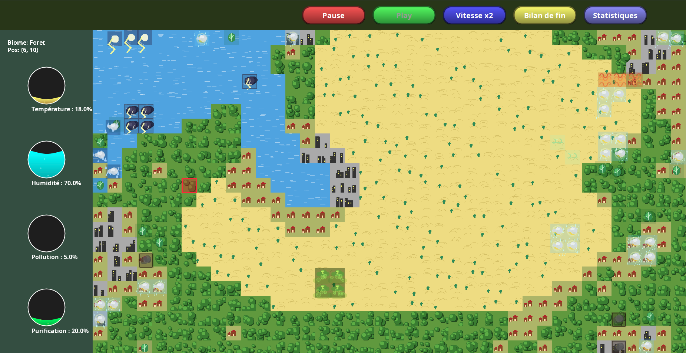
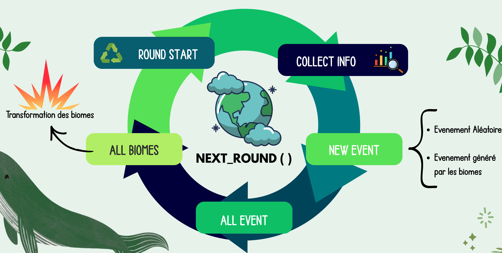
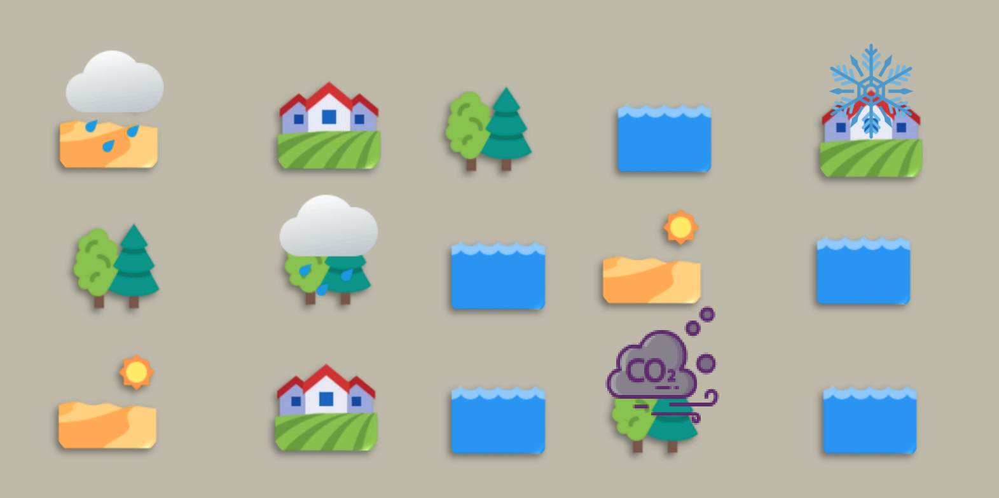

# RAPPORT - Projet Environnement

## Structure obligatoire

### Page de garde
- CY Cergy-Paris Université
- RAPPORT
- Projet Génie Logiciel et Conception (L2)
- L2 Informatique
- **Environnement** (titre du projet)
- Auteurs: Feraoun Mohamed Amine, Nidhal Ourdani, Anurajan Thenuxan
- Avril 2026

---

## Introduction (1 mot - OBLIGATOIRE)

### Contexte du projet

Le projet Environnement est une application de simulation écologique développée en Java. Une simulation écologique est un modèle informatique qui reproduit l'évolution d'un écosystème naturel au cours du temps, permettant d'étudier les interactions entre différents éléments et leur environnement.

Dans ce projet, l'écosystème est représenté par une grille où chaque cellule contient un biome, c'est-à-dire une région naturelle caractérisée par son climat et sa végétation. Sept types de biomes sont modélisés : Forêt, Désert, Mer, Montagne, Banquise, Ville et Village. Chaque biome possède des propriétés intrinsèques (température, humidité, pollution, purification) qui définissent son état environnemental.

La dimension temporelle de la simulation est gérée par rounds. À chaque round, des événements météorologiques (Pluie, Vent, Pollution, Météore) affectent les caractéristiques des biomes et peuvent déclencher des transformations automatiques selon des règles écologiques prédefinies. Par exemple, une forêt touchée par une longue période de sécheresse peut se transformer en désert.

### Problématique

La problématique centrale du projet consiste à concevoir un système de simulation permettant de gérer l'évolution d'un écosystème sur une grille. Plusieurs questions guident le développement :

- Comment un biome réagit-il aux conditions environnementales changeantes (température, humidité, pollution) ?
- Comment les événements climatiques propagent-ils leurs effets sur la carte ?
- Quand et comment un biome se transforme-t-il en un autre type de biome ?
- Comment visualiser cette évolution sur une interface graphique ?

Ces questions visent l'objectif de créer une simulation dynamique et réaliste, accessible via une interface graphique.

### Enjeux

Le projet présente plusieurs enjeux majeurs sur le plan de la conception logicielle :

- **Extensibilité** : L'architecture doit permettre d'ajouter facilement de nouveaux types de biomes ou d'événements sans modifier le code existant. Cela implique une séparation claire entre les données et les traitements.

- **Maintenabilité** : Le code doit être modulaire et bien structuré pour faciliter les futures évolutions et corrections. Une mauvaise conception rendrait le projet difficile à maintenir à long terme.

- **Travail collaboratif** : En équipe de trois développeurs, une conception claire et des conventions partagées sont essentielles pour éviter les conflits et garantir la cohérence du code.

- **Modélisation réaliste** : Les règles de transformation écologique doivent refléter des phénomènes naturels plausibles tout en restant simples à implémenter.

### Objectif principal

L'objectif principal est de développer une application complète de simulation écologique permettant :

- La création d'une carte configurable composée de sept types de biomes (Forêt, Désert, Mer, Montagne, Banquise, Ville, Village)
- L'apparition dynamique d'événements environnementaux (Pluie, VentFroid, VentChaud, Pollution, Purification, Météore, et leurs variantes)
- La transformation automatique des biomes selon huit règles écologiques : Inondation, Glaciation, Désertification, Forestation, PollutionExtreme, Civilisation, Densification, PluieAcide
- La visualisation en temps réel via une interface graphique interactive en Java Swing

### Objectifs secondaires

Plusieurs fonctionnalités optionnelles peuvent enrichir l'application :

- Mini fenêtre affichant les statistiques de chaque biome en temps réel
- Mouvement fluide des événements sur la carte
- Options de personnalisation (paramètres de configuration, probabilités d'événements)
- Graphiques d'évolution des statistiques au cours du temps

### Organisation du rapport

Ce rapport est organisé en plusieurs sections distinctes :

1. **Page de garde** : Présentation du projet, des auteurs et de l'établissement
2. **Introduction** : Contexte, problématique, enjeux et objectifs
3. **Spécification** : Fonctionnalités attendues, contraintes techniques et règles de fonctionnement
4. **Conception et mise en œuvre** : Architecture logicielle, diagrammes de classes, explication des patterns de conception, interface graphique
5. **Manuel utilisateur** : Procédures d'installation, de compilation et d'exécution, guide d'utilisation
6. **Déroulement du projet** : Phases de développement et organisation de l'équipe
7. **Conclusion et perspectives** : Bilan du travail réalisé et perspectives d'amélioration
8. **Difficultés et solutions** : Problèmes rencontrés خلال le développement et leurs résolutions
9. **Références bibliographiques** : Sources documentaires utilisées

---

## Spécification

### Notions de base et contraintes du projet

#### Fonctionnement général du logiciel

Le fonctionnement du logiciel repose sur un modèle de simulation par tours, appelés rounds. À chaque round, le système exécute un cycle complet divisé en quatre étapes distinctes.

**1. Génération d'événements**
Au début de chaque round, de nouveaux événements météorologiques apparaissent aléatoirement sur la carte. Ces événements peuvent être des pluie, du vent, de la pollution, ou des météores.

**2. Déplacement des événements**
Les événements mobiles se déplacent d'une case dans une direction donnée. Ce déplacement peut être bloqué par les montagnes.

**3. Application des impacts**
Les événements affectent les caractéristiques des biomes qu'ils traversent. Par exemple, la pluie augmente l'humidité et diminue la température, tandis que la pollution augmente le niveau de pollution.

**4. Évaluation des transformations**
Les règles de transformation vérifient les conditions sur les propriétés des biomes. Si les critères sont atteints, le biome se transforme en un autre type.

La carte est représentée par une grille bidimensionnelle où chaque cellule contient un biome. Les dimensions de la grille sont configurables (par exemple 20×20 ou 30×30). Chaque biome possède quatre propriétés numériques : température, humidité, pollution et purification. Ces propriétés évoluent au fil des rounds sous l'effet des événements et peuvent déclencher des transformations automatiques selon des règles écologiques prédéfinies.

### Fonctionnalités attendues du projet

#### Gestion de la carte

La carte de simulation est représentée par une grille bidimensionnelle de cellules, appelées blocs. Chaque bloc contient un biome et est identifié par ses coordonnées (x, y). Les dimensions de la grille sont configurables (par exemple 20×20 ou 30×30).

La génération de la carte peut se faire de manière aléatoire avec une distribution pseudo-aléatoire des biomes. Les probabilités de chaque type de biome sont définies dans le fichier de configuration, permettant d'ajuster la répartition souhaitée.

Chaque bloc peut être consulté et modifié via des méthodes d'accès. La configuration permet de définir les dimensions par défaut et les probabilités de distribution des biomes.

#### Gestion des biomes

L'application modélise sept types de biomes, chacun représentant un écosystème distinct : Forêt, Désert, Mer, Montagne, Banquise, Ville et Village.

Chaque biome possède quatre propriétés numériques qui définissent son état environnemental :

- **Température** : degré thermique du biome
- **Humidité** : niveau d'humidité
- **Pollution** : niveau de pollution
- **Purification** : capacité de régénération naturelle

Le tableau suivant présente les valeurs initiales de ces propriétés pour chaque type de biome :

| Biome | Température | Humidité | Pollution | Purification |
|-------|------------|---------|-----------|--------------|
| Forêt | 18.0 | 70 | 5 | 20 |
| Désert | 45.0 | 5 | 0 | 2 |
| Mer | 15.0 | 100 | 10 | 5 |
| Village | 22.0 | 40 | 50 | 0 |
| Banquise | -10.0 | 80 | 0 | 5 |
| Montagne | 5.0 | 30 | 2 | 10 |
| Ville | 25.0 | 50 | 40 | 5 |

Ces propriétés évoluent sous l'effet des événements climatiques et peuvent déclencher des transformations automatiques selon les règles définies. La montagne fait exception : elle est immuable et ne peut être transformée par aucune règle.

**Transformations entre biomes**
Les biomes peuvent se transformer selon des chaînes logiques. Par exemple, une Forêt touchée par la désertification devient un Désert, puis peutredevenir une Forêt sous l'effet de la forestation. Ces transformations reflètent des phénomènes écologiques réels.

#### Gestion des événements

L'application gère treize types d'événements différents, divisés en deux catégories :

**Événements statiques**
Ces événements restent à une position fixe pendant leur durée de vie. Le Météore est le seul événement statique : il apparaît aléatoirement et affecte une zone autour de sa position.

**Événements mobiles**
Ces événements se déplacent d'une case à chaque round dans une direction donnée. Ils traversent la carte et affectent les biomes qu'ils traversent.

| Événement | Catégorie | Durée | Température | Humidité | Pollution | Purification |
|----------|----------|------|------------|----------|------------|-------------|
| Pluie | Mobile | 4 | 0 | +5 | 0 | 0 |
| PluieAcide | Mobile | 4 | 0 | +5 | +10 | 0 |
| VentFroid | Mobile | 4 | -5 | 0 | 0 | 0 |
| Pollution | Mobile | 4 | 0 | 0 | +10 | 0 |
| Purification | Mobile | 4 | 0 | 0 | 0 | +5 |
| Météore | Statique | 20 | +50 | 0 | +20 | 0 |
| Orage | Mobile | 6 | 0 | +10 | 0 | 0 |
| Grêle | Mobile | 3 | -10 | +5 | 0 | 0 |
| Tornade | Mobile | 8 | 0 | +5 | +5 | 0 |
| PluieBénite | Mobile | 5 | 0 | +8 | -5 | +10 |
| Zéphyr | Mobile | 3 | +5 | 0 | 0 | 0 |
| Tonnerre | Mobile | 2 | 0 | +8 | 0 | 0 |
| Smog | Mobile | 6 | 0 | 0 | +15 | 0 |
| NuageToxique | Mobile | 7 | 0 | 0 | +20 | 0 |

**Formations d'événements**
Les événements peuvent être générés selon différentes formations : unique, ligne horizontale, ligne verticale, carré 2×2, carré 3×3, T, L, diagonale, cercle, croix. Chaque formation définit la disposition spatiale des événements lors de leur apparition.

**Déplacement des événements**
Chaque événement mobile possède une direction de déplacement (nord, sud, est, ouest) définie lors de sa création. À chaque round, l'événement se déplace d'une case dans cette direction.

Quand le déplacement est bloqué par une montagne, l'événement choisit une nouvelle direction aléatoire pour continuer son parcours. Si aucune direction n'est possible, l'événement reste en place.

Chaque événement possède une durée de vie définie. Quand cette durée expire, l'événement disparaît de la carte. De même, si un événement sort des limites de la carte, il est supprimé.

#### Système de transformation

Huit règles de transformation écologique contrôlent l'évolution des biomes au fil des rounds. Chaque règle vérifie des conditions spécifiques sur les propriétés d'un biome et déclenche une transformation automatique vers un autre type de biome si les critères sont atteints.

**Inondation** : Transforme un biome en Mer si l'humidité dépasse un seuil.

**Glaciation** : Transforme un biome en Banquise si la température descend sous un seuil.

**Désertification** : Transforme un biome en Désert si l'humidité est trop basse.

**Forestation** : Transforme un biome en Forêt sous certaines conditions d'humidité et température.

**PollutionExtreme** : Transforme un biome en fonction du niveau de pollution.

**Civilisation** : Transforme un biome en Ville ou Village selon les règles définies.

**Densification** : Transforme un Village en Ville.

**PluieAcide** : Transforme les événements Pluie en PluieAcide sous condition de pollution.

Chaque règle est définie par des conditions et un biome cible. Les transformations sont irréversibles (sauf pour la montagne).

Le tableau suivant présente les conditions exactes de chaque règle :

| Règle | Condition principale | Biome cible |
|-------|------------------|-------------|
| Inondation | Humidité ≥ 90, Température ≥ 5, Pollution ≤ 40 | Mer |
| Glaciation | Température ≤ 0, Humidité ≥ 20, Pollution ≤ 20 | Banquise |
| Desertification | Température ≥ 50, Humidité ≥ 90 ou ≤ 10 | Désert |
| Forestation | Température 10-35, Humidité 60-90, Pollution ≤ 25 | Forêt |
| PollutionExtreme | Température ≥ 80, Humidité 10-90, Pollution ≤ 10 | - |
| Civilisation | Température 15-40, Humidité 20-80, Pollution ≤ 10 | Ville |
| Densification | Température 18-45, Humidité 30-70, Pollution 10-60 | Ville |
| Erosion | Humidité ≤ 40, Pollution ≤ 5, Purification ≥ 40 | - |

#### Interface graphique

L'interface graphique permet de visualiser et contrôler la simulation en temps réel.

**Zone d'affichage**
La carte est affichée sous forme de grille où chaque cellule représente un biome. Les couleurs ou icônes distinguent les différents types de biomes (Forêt, Désert, Mer, Montagne, Banquise, Ville, Village). Les événements sont représentés par des symboles superposés à la grille.

**Affichage des événements**
Les événements sont représentés par des symboles distincts selon leur type. Ils apparaissent au-dessus des biomes et se déplacement visuellement à chaque round. La visualisation permet de suivre le parcours des événements sur la carte.

**Contrôles de simulation**
L'interface propose plusieurs boutons :

- **Play** : Démarrer la simulation
- **Pause** : Arrêter la simulation
- **Vitesse x2** : Doubler la vitesse de simulation
- **Bilan de fin** : Ouvrir le bilan de fin de partie
- **Statistiques** : Ouvrir une fenêtre avec les statistiques détaillées

**Statistiques**
Une fenêtre dédiée affiche les statistiques en temps réel : nombre de chaque type de biome présent sur la carte.

**Mode édition**
Un panneau permet de modifier manuellement les biomes de la carte en cliquant sur les cellules.

#### Système de journalisation

Le système de journalisation permet de suivre l'exécution de la simulation et de déboguer le code en cas d'erreur.

**Niveaux de logs**
Deux niveaux sont utilisés :

- **DEBUG** : Messages détaillés pour le développement (trace des opérations)
- **INFO** : Messages généraux (démarrage, fin de simulation)

**Destinations**
Les logs sont écrits vers deux destinations :

- La console (pour le suivi en direct)
- Un fichier (src/logs/simulation.log) pour la consultation ultérieure

**Événements journalisés**
Les principales actions journalisées incluent : début/fin des rounds, déplacement des événements, transformation des biomes, génération d'événements.

---

## Conception et mise en œuvre (plusieurs mots - OBLIGATOIRE)

### Architecture globale du logiciel

#### Organisation des modules
- Module moteur (cœur de la simulation)
- Module gui (interface graphique)
- Module config (configuration)

#### Diagramme d'architecture
[image: architecture.jpg]

### Classes de données

#### Hiérarchie des biomes
- Classe abstraite Biome
- Sous-classes: Foret, Desert, Mer, Montagne, Banquise, Ville, Village
[image: classes_biome.jpg]

#### Hiérarchie des événements
- Classe abstraite Evenement
- Événements statiques (Meteore)
- Événements mobiles
- Groupes d'événements
[image: classes_evenement.jpg]

#### Gestion de la carte
- Classe Carte
- Classe Bloc

### Patron Visitor (CONCEPT IMPORTANT)

#### Principe du patron
- Séparation algorithmes et objets
- Double implémentation: EvenementVisitor et BiomeVisitor

#### Implémentation dans le projet
- EvenementVisitor: méthodes visit() pour chaque type d'événement
- BiomeVisitor: méthodes visit() pour chaque type de biome
- Avantages: extensibilité, maintenance

[image: visitor_pattern.jpg]

#### Flux d'exécution d'un round
- Génération d'événements
- Déplacement des événements
- Application des impacts
- Évaluation des règles

[image: flux_round.jpg]

### IHM Graphique

#### Structure de l'interface
- MainGUI: fenêtre principale
- MainDisplayer: zone d'affichage
- PanelStatistique: statistiques
- PanelTemps: contrôle du temps
[image: ihm_structure.jpg]

#### Stratégie de rendu
- StrategiePeinture: rendu graphique
- Méthodes paint() spécialisées

#### Exemple de carte
[image: carte_exemple.jpg]

### Conception des traitements

#### Le manageur
- ManageurBasique: orchestre la simulation
- Méthode nextRound()

#### Gestion du déplacement
- GestionDeplacementVisitor: déplacement des événements
- Bloquage par les montagnes
- Mort collective pour les groupes

#### Règles de transformation
- Huit règles implémentées
- Interface RegleTransformation
- Interface RegleTransformationEvenement

#### Génération événementielle
- EvenementFactory
- GenerateurEvenementVisitor

#### Groupes d'événements
- GroupePluie (3 unités)
- GroupePluieAcide
- Logique de mort collective

#### Système de logging
- LoggerUtility: singleton
- log4j.properties
- Niveaux DEBUG/INFO

---

## Manuel utilisateur (plusieurs mots - OBLIGATOIRE)

### Installation et configuration
- Prérequis (JDK 8+)
- Compilation
- Lancement

### Utilisation de l'interface
- Fenêtre principale
- Génération de carte
- Contrôle de la simulation
- Mode édition
- Statistiques
- Consultation des logs
- Modification du niveau de logs

---

## Déroulement du projet (plusieurs mots - OBLIGATOIRE)

### Réalisation du projet par étapes
- Phase 1: Analyse et conception
- Phase 2: Implémentation des classes de données
- Phase 3: Implémentation du moteur de simulation
- Phase 4: Interface graphique
- Phase 5: Fonctionnalités avancées
- Phase 6: Tests et corrections

### Répartition des tâches et intégration
- Organisation de l'équipe
- Gestion de version (Git)
- Intégration continue

---

## Conclusion et perspectives (plusieurs mots - OBLIGATOIRE)

### Résumé du travail réalisé
- Synthèse du projet
- Objectifs atteints
- Compétences développées

### Améliorations possibles du projet
- Extensions fonctionnelles
- Optimisations techniques
- Améliorations de l'interface

---

## Difficultés et solutions (plusieurs mots - OBLIGATOIRE) (FIN DU RAPPORT)

### Difficultés et solutions
- Difficulté 1: Gestion des contraintes de valeurs
- Difficulté 2: Montagne comme mur
- Difficulté 3: Transformation des groupes d'événements
- Difficulté 4: Protection du biome montagne
- Difficulté 5: Système de logging
- Difficulté 6: Affichage des nouveaux éléments

---

## Références bibliographiques (OBLIGATOIRE - ~10 références)

À compléter:
1. Java SE Documentation (Oracle)
2. Apache Log4j Documentation
3. Java Swing Tutorial
4. Design Patterns (Gang of Four)
5. Git Documentation
6. (à compléter par vous)

---

## Règles à respecter (IMPORTANT)

### Titres
- Introduction = 1 SEUL mot (OBLIGATOIRE)
- Tous les autres titres = plusieurs mots (OBLIGATOIRE)
- Difficultés = à la FIN du rapport (OBLIGATOIRE)

### Style
- Utiliser \paragraph{} pour tous les blocs de texte (OBLIGATOIRE)
- INTERDIT: couleur rouge
- INTERDIT: "Dans le cadre de..." (pénalité -2 pts)
- INTERDIT: ton personnel ("j'ai aimé", "j'ai progressé")
- Rester technique et factuel

### Contenu
- Expliquer les patterns (Strategy, Visitor) CONCRÈTEMENT dans le code
- Ne pas lister les outils sans contexte
- ~30 pages de contenu intéressant

### Images
- Schémas à créer: architecture.jpg, classes_biome.jpg, classes_evenement.jpg, flux_round.jpg, visitor_pattern.jpg, ihm_structure.jpg, carte_exemple.jpg
- Format: JPG
- Emplacement: doc/images/